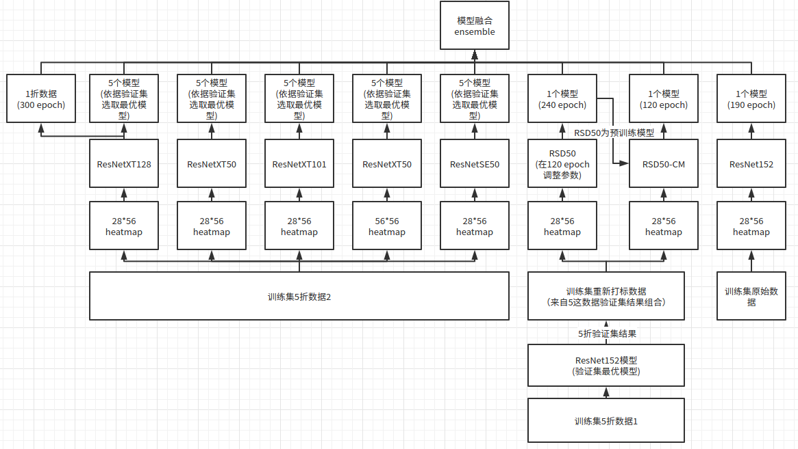

# 2021 CCF BDCI基于飞桨实现花样滑冰选手骨骼点动作识别-第1名方案
> 
## 项目描述
CCF大数据与计算智能大赛基于飞桨实现花样滑冰选手骨骼点动作识别----新东方人工智能研究院队伍

## 硬件要求
1、由于模型基于3D卷积搭建，因此整体资源要求较高.

2、由于模型较多，为保证快速复现num_worker尽量不要设置为0.

3、因为num_worker不设置为0，训练过程中会占用大量的共享内存，因此共享内存目录（/dev/shm/）尽量分配多一些空间。若num_worker=0，则占用共享内存较小，但是训练速度降低较多。

## 项目整体架构
> 本算法主要由三个系列的模型集合组成XtSe系列、RSD系列模型、ResNet152系列模型。每个系列模型的数据与训练方式均有不同，整体算法架构如下图所示，详细说明在下文。



## 项目结构
由于数据文件较多，首先需要解压数据，保证目录统一
```
cd data
unzip 
```

data解压后，项目的整体目录层级如下
```
|- data
     |- XtSe
     |- Distill
     |- Res152
     |- test_B_data.npy
|- work
     |- XtSe
         |- 模型代码文件
         |- train.sh
         |- test.sh
     |- Distill
         |-  模型代码文件
         |-  train.sh
         |-  test.sh
     |- Res152
         |- 模型代码文件
         |- train.sh
         |- test.sh
     |- Kaggle-Ensemble-Guide-master
|- requirements.txt
|- 花样滑冰比赛文档.docx
|- .gitignore
|- README.md
# 在work/路径下，有三个主要的模型对应的文件夹，其中XtSe/文件夹里面的是XtSe系列的模型，Distill/文件夹里面是RSD系列模型，Res152/文件夹里面是ResNet152系列模型，最终结果基于以上所有的模型的集成得到。
```


## 模型推理
模型运行前需要安装必要环境
```
pip install -r requirements.txt -i https://pypi.tuna.tsinghua.edu.cn/simple/ 
```

直接利用本次比赛模型生成好的29个csv直接融合，生成B榜结果
```
cd work/Kaggle-Ensemble-Guide-master
tar -xvf testB.tar
python src/kaggle_vote.py "testB/submissions/*.csv" "./submission.csv"
```

### 利用模型推理29个模型csv结果

推理XtSe系列模型结果
```
cd work/XtSe/
sh test.sh
```
推理RSD系列模型结果
```
cd work/Distill/
sh test.sh
```
推理Res152系列模型结果
```
cd work/Res152/
sh test.sh
```

基于投票的方式进行模型融合，将所有模型得到的csv文件放到work/Kaggle-Ensemble-Guide-master/submissions下
```
cd work/Kaggle-Ensemble-Guide-master
python src/kaggle_vote.py "./submissions/*.csv" "./submission.csv"
```

## 模型训练
### 数据
生成XtSe系列数据（AIStudio环境中已经给出我们分好的五折数据，尽量使用此数据进行复现，如果使用代码重新分组，不能保证数据分布与已给出的五折数据分布一致）。
```
#详见此目录下的README.md
python work/XtSe/tools/split_crossval.py
```
生成RSD系列模型数据
```
# 详见此目录下的README.md
cd work/Distill
python relabel_5fold.py ../../data/Distill/5fold_val_data/valdata_%d.npy ../../data/Distill/5fold_val_pred/nwc5-%d.npy ../../data/Distill/new_train1/
# RSD训练数据中npy文件为利用在训练集5折数据上训练的ResNet152模型在训练集数据上重新打标得到，可以详见work/RSD/README.md计算npy
```

Resnet152系列模型数据，就是原始训练数据，在如下位置
```
data/Res152
```

### 模型训练
训练XtSe系列模型
```
cd work/XtSe/
# 训练较为复杂，详见此目录下的README.md
# sh train.sh
```
训练RSD系列模型
```
cd work/Distill/
sh train.sh
```
训练Resnet152系列模型
```
cd work/Res152/
sh train.sh
```


